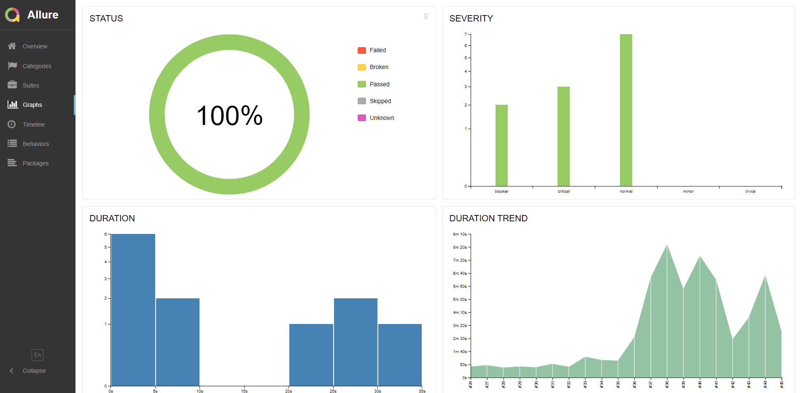
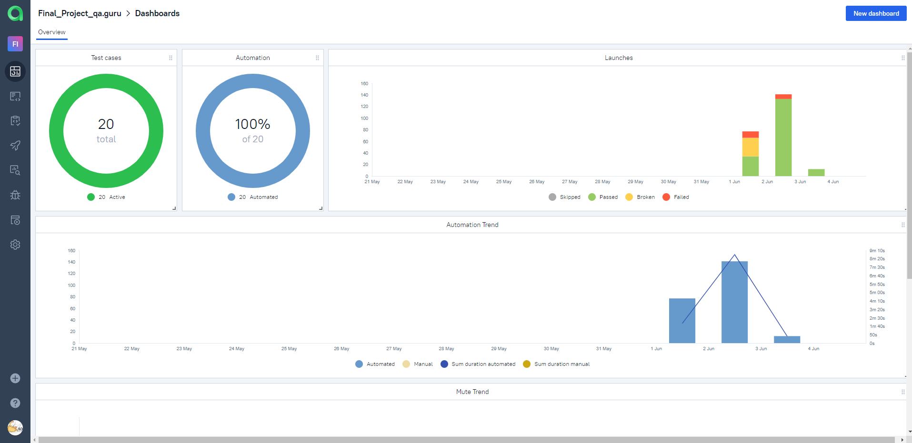
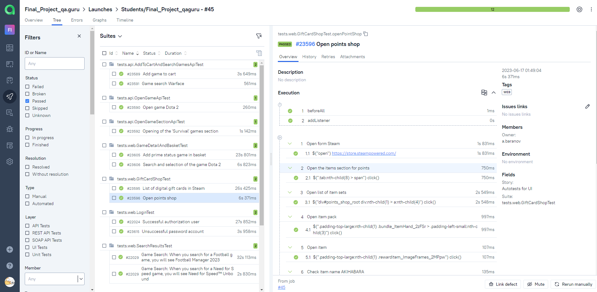

# Дипломный проект по автоматизации тестирования UI, API для сайта STEAM

<p align="center">

</p>

## :pushpin: Содержание:

* <a href="#tools">Использованный стек технологий</a>
* <a href="#description">Общая информация о проекте</a>
* <a href="#cases">Реализованные проверки</a>
* <a href="#console">Запуск автотестов</a>
* <a href="#jenkins">Запуск тестов в Jenkins</a>
* <a href="#allure">Allure отчеты</a>
* <a href="#allure_testops">Интеграция с Allure TestOps</a>
* <a href="#jira">Интеграция с Jira</a>
* <a href="#telegram">Уведомления в Telegram с использованием бота</a>
* <a href="#video">Видео примера запуска тестов в Selenoid</a>

<a id="tools"></a>
## :computer: Использованный стек технологий

<p align="center">


</p>

<a id="description"></a>
<a name="Description"><h2>Общая информация о проекте:</h2></a>

</code></a> Дипломный проект по автоматизации тестирования для сайта Steam - онлайн-сервис цифрового распространения компьютерных игр и программ, 
разработанный и поддерживаемый компанией Valve


- В данном проекте автотесты написаны на языке <code>Java</code> с использованием фреймворка для тестирования Selenide. 
- В качестве сборщика был использован - <code>Gradle</code>.  
- Использован фреймворк <code>JUnit 5</code> в качестве модульного тестирования.
- При прогоне тестов браузер запускается в [Selenoid](https://aerokube.com/selenoid/).
- Тестирование API выполняется с помощью библиотеки <code>Rest Assured</code>.
- Запуск тестов выполняется в <code>Jenkins</code> с формированием Allure-отчета и отправкой результатов в <code>Telegram</code> при помощи бота. 
- Осуществлена интеграция с <code>Allure TestOps</code> и <code>Jira</code>

<a id="cases"></a>
## :heavy_check_mark: Реализованные проверки

### &nbsp;&nbsp;&nbsp;&nbsp;&nbsp;&nbsp; UI

- ✓ Проверка успешной авторизации пользователя
- ✓ Проверка не успешной авторизации пользователя
- ✓ Проверка добавления прайм-статуса в корзину для игры "Counter-Strike: Global Offensive"
- ✓ Проверка поиска и открытие карточки игры "Dota 2"
- ✓ Проверка отображения раздела со списком электронных подарочных карт
- ✓ Проверка открытия карточки предмета в магазине предметов за очки
- ✓ Проверка отображения результата поиска "TEKKEN 8" при поиске игры "Tekken"
- ✓ Проверка отображения результата поиска "Need for Speed™ Unbound" при поиске игры "Need for Speed"
### &nbsp;&nbsp;&nbsp;&nbsp;&nbsp;&nbsp; API

- ✓ Проверка поиска игры "Warface"
- ✓ Проверка открытие карточки игры "Dota 2"
- ✓ Проверка открытия раздела игр "Выживание"
- ✓ Проверка добавления игры в корзину

Содержание Allure-отчета:
* Шаги теста;
* Скриншот страницы на последнем шаге;
* Page Source;
* Логи браузерной консоли;
* Видео выполнения автотеста.

<a id="console"></a>
## :arrow_forward: Запуск автотестов
### :house_with_garden: Локальный запуск тестов
#### WEB
```
gradle clean web_test 
```

#### API

```
gradle clean api_test 
```
При выполнении команды, данные тесты запустятся удаленно в <code>Selenoid</code>.

### :earth_asia: Запуск тестов на удаленном браузере
```
gradle clean test -Denv=main
```
При необходимости также можно переопределить параметры запуска

```
clean test
-DremoteUrl=${SELENOID_URL}
-DbaseUrl=${BASE_URL}
-DbrowserSize=${BROWSER_SIZE}
-Dbrowser=${BROWSER_NAME}
-Dbrowser_version="${BROWSER_VERSION}"
```

### Параметры сборки

> `${BROWSER_NAME}` – браузер, в котором будут выполняться тесты. По-умолчанию - <code>chrome</code>. \
> `${BROWSER_VERSION}` – версия браузера, в которой будут выполняться тесты. По-умолчанию - <code>100.0</code>. \
> `${BROWSER_SIZE}` – размер окна браузера, в котором будут выполняться тесты. По-умолчанию - <code>1920x1080</code>.\
> `${BASE_URL}` – URL для открытия тестируемого приложения.\
> `${REMOTE_BROWSER_URL}` – адрес удаленного сервера, на котором будут запускаться тесты.

<a id="jenkins"></a>
##  Запуск тестов в Jenkins
<a target="_blank" href="https://jenkins.autotests.cloud/job/Final_Project_qaguru/#">Сборка в Jenkins</a>
<p align="center">

> Использование параметризованной сборки позволяет изменять параметры перед ее запуском, выбирая значения из списка или указывая их непосредственно.
<p align="center">

</p>

<a id="allure"></a>
##  Allure отчеты
### Overview

<p align="center">

</p>

### Результат выполнения теста

<p align="center">

</p>

### Графики
<p align="center">

</p>

<a id="allure_testops"></a>
##  Интеграция с Allure TestOps

> Выполнена интеграция сборки <code>Jenkins</code> с <code>Allure TestOps</code>.
> Результат выполнения автотестов отображается в <code>Allure TestOps</code>.
> На Dashboard в <code>Allure TestOps</code> отображена статистика пройденных тестов.

### Доска
<p align="center">

</p>

### Тест-кейсы

<p align="center">

</p>

### Launches

<p align="center">

</p>

<a id="jira"></a>
##  Интеграция с Jira

> Реализована интеграция <code>Allure TestOps</code> с <code>Jira</code>.
> В тикете представлена информация о тест-кейсах, которые были разработаны в рамках задачи, а также результаты их проверки

<p align="center">

</p>

<a id="telegram"></a>
##  Уведомления в Telegram с использованием бота

> После завершения сборки, бот созданный в <code>Telegram</code>, автоматически обрабатывает и отправляет сообщение с результатом.

<p align="center">

</p>

<a id="video"></a>
## :movie_camera: Видео примера запуска тестов в Selenoid

> К каждому тесту в отчете прилагается видео прогона.
<p align="center">
  
</p>
